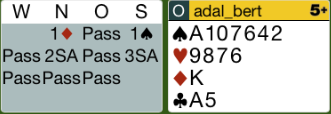
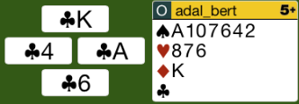
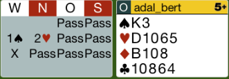
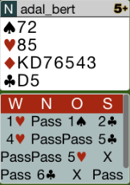
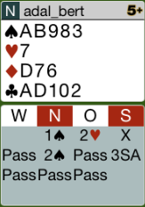
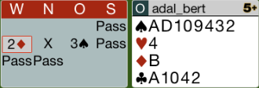
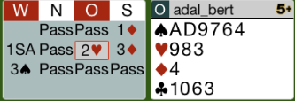
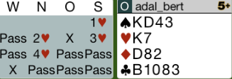
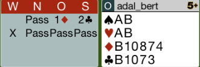
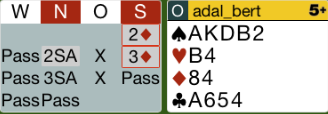

## Board 1

Das Ausspiel gegen 3SA ist natürlich die C9. 
Wenn man nun mit dem TA noch einmal an den Stich kommt, sollte man die C6 
nachspielen, damit der Partner sehen kann, dass man eine 4er Länge hat.

Hier das komplette [Board-1](images/board1.png)

## Board 2

In diesem Board haben wir nicht die Majorität der Punkte,
trotzdem kann man diesen Kontrakt bei genauem Spiel schlagen.

Das richtige Ausspiel in diesem Board ist der Karo Bube!

Pik Ausspiel ist nicht gut, da man mit dieser Hand nicht stechen will.

Hier das komplette [Board-2](images/board2.png)

## Board 4

Der Partner ist alleine auf 5T gegangen und hat die 5C vom Gegner kontriert.
Der Partner hat wahrscheinlich Treff und Pik und mindestens Eröffnungsstärke.

Da ich die Karo halte und zudem noch Dx in Treff dazu habe, sollte ich in diesem 
Kontra drin bleiben.

Das normale Ausspiel ist die Treff D. Danach kann ich sofort auf Trumpf wechseln.
Der Alleinspieler kann die 5C nicht erfüllen.

Hier das komplette [Board-4](images/board4.png)

## Board 5

Die korrekte Reizung nach dem Kontra des Partners ist 3T. 
Dies gibt die richtige Verteilung durch. Nach dem Kontra ist 3T keine 
Reverse-Reizung.

3SA ist der richtige Kontrakt.

Hier das komplette [Board-5](images/board5.png)

## Board 7

Die Reizung 3P bedeutet *ausbrechen* aus dem System!
Systemgemäß muss man hier einfach 2C reizen.

In Coeur wird man auch seine 9 Stiche machen.

Hier das komplette [Board-7](images/board7.png)

## Board 9

Die 3P nach der 3K - Reizung der Gegner zeigt eine 4er Länge und ein Double.
Mit der Ost-Hand muss man auf 4P gehen!

Hier das komplette [Board-9](images/board9.png)

## Board 11

Das Kontra von mir ist einfach undiszipliniert! Es sind nur 11 Punkte.
Somit kann die Kathastrophe seinen Lauf nehmen.
Da Aurel auch ein paar Punkte hat, werden die 4C kontriert.
Leider können wir diesen Kontrakt nicht schlagen. Deshalb ein Nuller!

Hier das komplette [Board-11](images/board11.png)

## Board 13

Dies ist ein interessantes Board! Man darf mit meiner Hand nicht passen,
da ich keine 2 Stiche in Treff habe. Die richtige Reizung ist 2SA.

Danach kann man 6SA ausreizen.

Da Süd zwischengereizt hat, weiß man, dass alle Punkte bei Süd sind.
Man braucht die fehlenden Damen nicht suchen. Über einen Squeeze kann man dann
diesen Schlemm erfüllen. In meinen Augen wäre 6K oder sogar 7K einfacher.

Hier das komplette [Board-13](images/board13.png)

## Board 15

Mit dieser Hand sind beide Kontras falsch. Pass ist richtig!

Hier das komplette [Board-15](images/board15.png)
