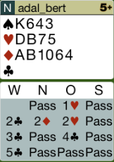
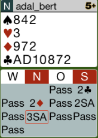
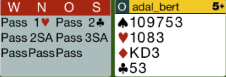
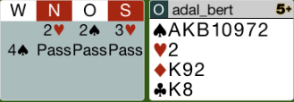
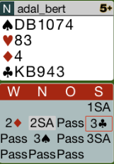
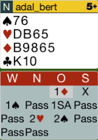
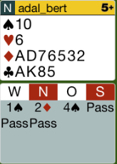
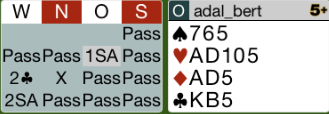

## Board 1

Kontra statt 2K, spielbereit in allen anderen Farben.
Ausspiel C5! Das bringt den Alleinspieler in große Schwierigkeiten!

Hier das komplette [Board-1](images/board1.png)

## Board 2

Mit dieser 6er Treff muss man marschieren.
Nach 2SA ist die richtige Reizung 3P (6er Unterfarbe).
Der Partner antwortet mit 3SA. Trotzdem muss man mit 4Treff
forcieren und den Schlemm ausreizen.

Hier das komplette [Board-2](images/board2.png)

## Board 4

Mit 5 Punkten muss man für den Partner ausspielen.
Dies bedeutet Karo-K! Pik-10 macht keinen Sinn, da man nicht 
oft genug an den Stich kommt. Nach KK ist es für den Alleinspieler
unmöglich, den Kontrakt zu erfüllen.

Hier das komplette [Board-4](images/board4.png)

## Board 5

2 Pik ist zu schwach gereizt für diese massive Hand.
Deshalb erst Kontra und dann Pik reizen.
4 Pik wird der richtige Kontrakt, aber wenn der Partner etwas 
stärker ist, kommen wir in den Schlemm.

Hier das komplette [Board-5](images/board5.png)

## Board 7

1SA - 2K - 3C! Dies zeigt die Pik-Farbe mit 8-10 Punkte und Single 
in Karo. Der Partner kann nun entscheiden, was der richtige Kontrakt ist.

Hier das komplette [Board-7](images/board7.png)

## Board 10

Coeur D ist das richtige Ausspiel. Nach D-K-A-2 spielt der Partner
die 3 zurück. Dies zeigt eine 4er Länge. Es ist somit gut, den Gegner
in Trumpf zu kürzen und Coeur weiterzuspielen.

Hier das komplette [Board-10](images/board10.png)

## Board 12

In umgekehrter Gefahrenlagen wäre es gut, nach 4P noch 4SA zu reizen.
In dieser Gefahrenlage ist es richtig zu passen.

Mit dieser extremen Verteilung ist es gut, AK in Treff und A in 
Karo abzuspielen. Danach kann man spielen, was man will.

Hier das komplette [Board-12](images/board12.png)

## Board 15

Nach Coeur Ausspiel ist es richtig, den Karo Schnitt zu machen.
Nachdem die Dame den Stich gemacht hat, muss man auf Pik wechseln.
Die Gegner sind komplett im Dunkelen.

Hier das komplette [Board-15](images/board15.png)
