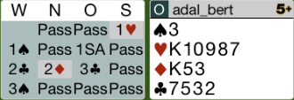
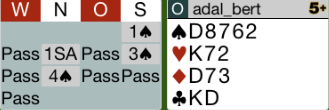
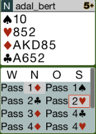
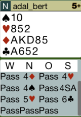
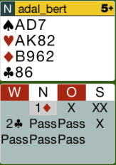
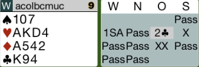
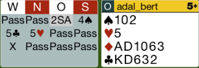
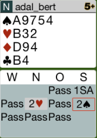

## Board 1

Nach der Zwischenreizung vom Partner braucht man mit dieser
Hand nicht zu antworten. Man hält die Farbe des Gegners und könnte
später kontrieren.

Auch die 3T - Reizung ist falsch. Auch hier wäre Pass richtig.

Nach 3P muss man allerdings auf 4T ausbessern. 3P hat keine Chance.

Hier das komplette [Board-1](images/board1.png)

## Board 3

Der Partner hat den Treff B ausgespielt. Hier muss man die Pik-D zugeben, um den Partner nicht zu täuschen.
Der Alleinspieler hat Treff am Tisch gestochen und hat auf Karo - AK zwei Treff abgeworfen.
Nun spielt er die Pik 9. Diese muss man mit der Dame decken, dann gibt der Gegner 4 Stiche ab.

Hier das komplette [Board-3](images/board3.png)

## Board 8

2C vom Partner ist 4te Farbe forcing. Nun muss als Antwort 3C = 5te Farbe forcing kommen.
3K würde eine 6er Länge versprechen.

Partner zeigt mit seiner 4T Reizung 4er Treff Unterstützung und Schlemm Interesse.

Hier das komplette [Board-8](images/board8.png)

## Board 9

Die Reizung ist in Ordnung.

Das Ausspiel nach einer solchen Reizung muss Trumpf sein!
Die Treff-6 wäre hier das richtige Ausspiel.

Hier das komplette [Board-9](images/board9.png)

## Board 11

Das Rekontra vom Partner zeigt Interesse an dem Kontrakt, wenn der Partner 4er Länge hat.

Der Spielplan muss hier sein, einen Pik am Tisch zu stechen!

Hier das komplette [Board-11](images/board11.png)

## Board 12

Diese Hand ist zu stark um mit 2SA zu eröffnen. Die richtige Reizung wäre 1K.

Hier das komplette [Board-12](images/board12.png)

## Board 14

Nach dem Transfer muss man noch mit 2SA einladen und seine 8 Punkte zeigen.
Der Partner kann dann den richtigen Kontrakt 3SA ausreizen.

Hier das komplette [Board-14](images/board14.png)
