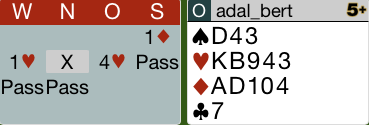
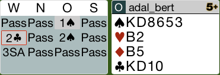
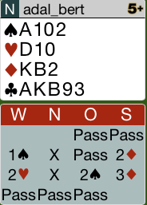

## Board 7

Nach dem Kontra des Gegners auf 1C ist die richtige Reizung Rekontra!
Dies zeigt dem Partner die Stärke der Hand und eventuell kann man den 
Gegner im Kontra spielen lassen.

Hier das komplette [Board-7](images/board7.png)

## Board 8

Dies Hand ist auch in 3ter Hand eine schwache Eröffnung.
Die beiden Buben zählen erst mal nicht so recht.
Die richtige Reizung ist 2K.

Wenn der Partner die Stärke des Partners kennt, wird er nur einen 
Teil-Kontrakt reizen, was hier die richtige Entscheidung ist.

Hier das komplette [Board-8](images/board8.png)

## Board 10

Das Kontra auf 1P ist vertretbar, da die 18 Punkte definitiv aufzuwerten sind.
Das zweite Kontra ist hingegen falsch. Hier muss man mit 3C überrufen und den
Partner nach einem Coeur-Stopper fragen. 

Der richtige Kontrakt ist 3SA gespielt von Süd!

Hier das komplette [Board-10](images/board10.png)

