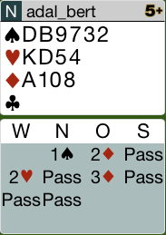
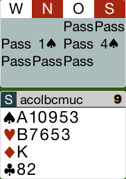
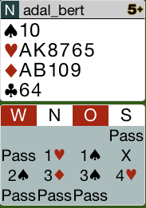
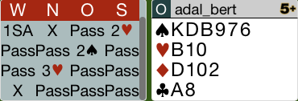
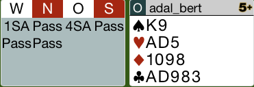
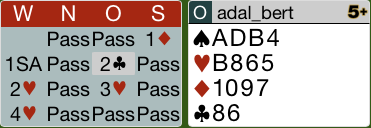
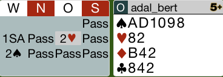

## Board 1

Die Reizung war in Ordnung. Nach Pik Ausspiel wird CA und Coeur gespielt.
Der Partner wird die 10 haben, deshalb die C5 zugeben.

Hier das komplette [Board-1](images/board1.png)

## Board 2

Diese Reizung verspricht eine stichhaltige Hand mit maximal 10 Punkten.

Hier das komplette [Board-2](images/board2.png)

## Board 3

Nach der Zwischenreizung von 2P zeigt 3K eine Revers-Hand.
Die richtige Reizung wäre erst einmal pass und danach 3K.
4C ist der richtige Kontrakt.

Hier das komplette [Board-3](images/board3.png)

## Board 10

Dies ist eine Hand, mit der man versuchen muss, den Alleinspieler zu kürzen.
Der Partner hat die Pik-8 ausgespielt. Die zeigt, dass Süd eine 5er Länge hat.
Sobald Ost an den Stich kommt, muss man Pik-K weiterspielen. Dann fällt der Kontrakt 
mindestens einmal.

Hier das komplette [Board-10](images/board10.png)

## Board 12

Diese Hand hat 15 Punkte, aber 6 mittlere Karten. Dies bedeutet eine Aufwertung von 2 Punkten.
In 4SA zu springen ist zu schwach. Man muss über 2T und dann 3T gehen, damit der Partner auf 4SA 
nicht passen kann.

6SA ist der richtige Kontrakt.

Obwohl es extrem feindlich steht, sind 12 Stiche zu machen.

Hier das komplette [Board-12](images/board12.png)

## Board 13

In dieser Hand hat man zwar einen Coeur-Fit gefunden, jedoch hält man 
in Karo 10-9-7. Dies ist für SA sehr gut, da der Partner 1-SA auf die
1K - Eröffnung des Gegners gereizt hat. 

Die richtige Reizung nach 2C ist somit 2SA. Der Partner hat die Möglichkeit,
3SA zu reizen.

Hier das komplette [Board-13](images/board13.png)

## Board 15

Auch hier gibt es eine Aufwertung wegen 5 mittleren Karten!
Nach dem Ausführen des Transfers muss man hier mit 2SA einladen.

Der richtige Kontrakt ist 3SA, in dem man wahrscheinlich 10 Stiche machen wird.

Hier das komplette [Board-15](images/board15.png)

