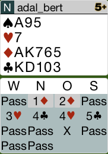

## Board 1

Das richtige Ausspiel ist die Pik-10. Dies ist der T7 vorzuziehen,
da es eine innere Squenz ist.

Hier das komplette [Board-1](images/board1.png)

## Board 2

Der Gegner reizt 4C aus. Der Partner spielt Karo-B aus.
Der Tisch bleibt klein. Hier nicht das Ass spielen.
Der Alleinspieler macht mit der blanken Karo-D den Stich,
hat aber große Probleme im Abspiel, da er nicht an den Tisch kommt.

Hier das komplette [Board-2](images/board2.png)

## Board 3

Die Reizung ist eine Spezialität des System.

Die richtige Spielwiese ist, nach dem Gewinn des Pik - Asses 
muss man die Karo-10 laufen lassen. Danach hat man keine Probleme mehr.

Hier das komplette [Board-3](images/board3.png)

## Board 5

Nach dem Zeigen eines Semiforcings in Coeur ist mit der Ost-Hand ein Schlemm 
möglich. Aus diesem Grunde sollte man seine Hand zeigen und 3-Pik reizen.
Dies zeigt eine 5er Pik.

Danach würde West 4Karo reizen und Ost 4SA.
Da West kein Cuebid in Treff hat, wird er auf 4SA passen.

Hier das komplette [Board-5](images/board5.png)

## Board 7

Das Ausspiel von C5 ist nicht verkehrt. Im Laufe es Abspiels wirft der Partner den Pik-B ab.
Da man am Tisch die blanke D sieht, sollte man nach dem Gewinn des Treff Königs das Pik-Ass
abspielen und mit Pik aussteigen.

Hier das komplette [Board-7](images/board7.png)

## Board 8

Nach 3C von West sollte Nord entweder Pass oder Kontra reizen.

Hier das komplette [Board-8](images/board8.png)

## Board 9

Mit dieser stichstarken Hand sollte man mit 2SA den Partner zu 3SA einladen.

Hier das komplette [Board-9](images/board9.png)

