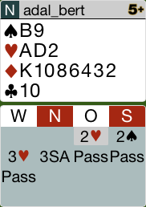
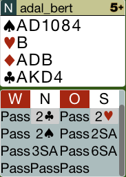
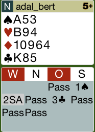
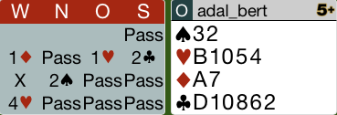
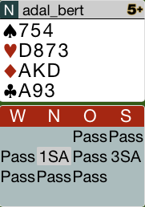
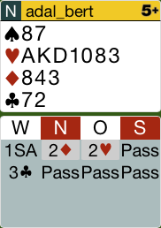

## Board 2

Die 3SA - Reizung ist ein *Ausbrechen aus dem System*!
Die richtige Reizung ist Kontra!

Nach Kontra findet man wahrscheinlich den 4-Pik-Kontrakt.

Hier das komplette [Board-2](images/board2.png)

## Board 3

Dies sind zwar 23 Punkte, jedoch hat man den Coeur-B single.
Dieser sollte nicht gezählt werden.

Stattdessen sollte man mit 2K eröffnen und nach 2P vom Partner
mit 2SA fortfahren. Der richtige Kontrakt ist 3SA.

Hier das komplette [Board-3](images/board3.png)

## Board 6

Die Reizung war richtig.

Das Ausspiel vom Partner war der Pik-Bube. In diesem Board muss man versuchen,
den Alleinspieler in Trumpf zu kürzen. Das richtige Rückspiel ist Coeur-4!

Hier das komplette [Board-6](images/board6.png)

## Board 7

Das Kontra vom Partner auf die 2P zeigt eine starke Hand mit 17 Punkten.
nach 2P sollte man seine Hand zeigen und 3P reizen! Dies fragt nach Pik-Stopper.

Der Partner kann 3SA reizen, da er zwei Stopper in Pik hat.

Hier das komplette [Board-7](images/board7.png)

## Board 10

Hier hat man 15 Punkte, die aber abzuwerten sind, da man eine 4333-Verteilung hat.
Besser ist die Eröffnung 1C.

Der Partner reizt 1SA. Dies sollte der Endkontrakt werden.

Hier das komplette [Board-10](images/board10.png)

## Board 12

Es macht keinen Sinn, hier in die Reizung zu gehen, da man den Alleinspieler nur vor dem 
3SA-Kontrakt warnt.

Falls die Gegner 3SA spielen, kann man in Ruhe seine 6 Coeur-Stiche abziehen.

Hier das komplette [Board-12](images/board12.png)

