## Board 2

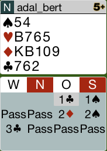

Das Ausspiel ist der Pik-König. Man sollte die P4 zugeben, 
da man nicht stechen will.

Hier das komplette [Board-2](images/board2.png)

## Board 3

Statt des Kontras sollte man taktisch 3C reizen, noch einmal
Transfer auf Pik, da man eine 6er Pik hat.

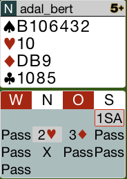

Hier das komplette [Board-3](images/board3.png)

## Board 4

Man hat eine 6er Coeur, deshalb 1C statt Kontra.

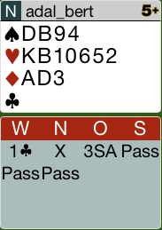

Hier das komplette [Board-4](images/board4.png)

## Board 6

Nord hat keine SA-Verteilung, deshalb einfach 1P reizen.

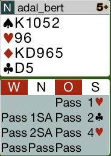

Hier das komplette [Board-6](images/board6.png)

## Board 8

Da man keine zwei Treff-Karten hat, sollte man 2K reizen.
Dies zeigt prinzipiell eine 6er Karo, oder 5er Karo, 4er OF.

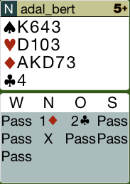

Hier das komplette [Board-8](images/board8.png)

## Board 10

Hier hat man eine massive Coeur - Unterstützung, deshalb sollte man
mit 2SA forcieren. Als Antwort bekommt man 3C = 5er Pik zu hören und
kann dann auf 4C erhöhen, da man die Pik-D als Unterstützung mit hat.

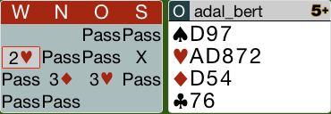

Hier das komplette [Board-10](images/board10.png)

## Board 11

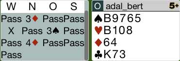

CB Ausspiel ist nicht so verkehrt. 
Wenn man allerdings mit dem Treff-K an den Stich kommt, sollte
man den Pik-B zurückspielen.

Hier das komplette [Board-11](images/board11.png)

## Board 12

Systemgemäß muss man nach der 3-Treff Zwischenreizung mit der 
Ost-Hand erst einmal kontrieren. Danach kann man immer noch 
seine Farbe ins Spiel bringen.

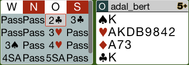
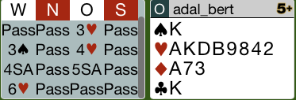

Hier das komplette [Board-12](images/board12.png)

## Board 13

Mit 4er Pik muss man auf das *Barbersohl-Kontra* 2-Pik reizen.

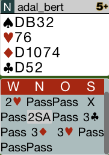
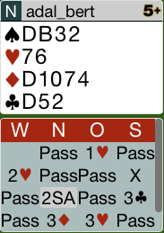

Hier das komplette [Board-13](images/board13.png)

## Board 14

Das Pass auf 1P ist richtig, nach 2T - Pass - Pass, muss man
nun mit 2C in die Reizung gehen.

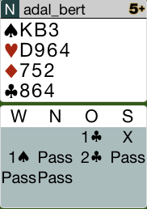

Hier das komplette [Board-14](images/board14.png)

