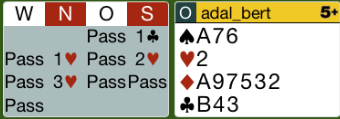
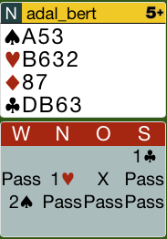
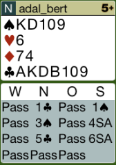
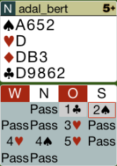

## Board 2

Das richtige Ausspiel ist T-3.

Hier das komplette [Board-2](images/board2.png)

## Board 7

Hier muss man mit 3T seine Verteilung zeigen. 3T zeigt 6-8 Punkte.

Hier das komplette [Board-7](images/board7.png)

## Board 8

Mit diesem Monument muss man gleich in 4Pik springen. 
Der Partner würde mit 5 Punkte auf 3 Pik passen.

Hier das komplette [Board-8](images/board8.png)

## Board 9

Auch hier muss man in 4Pik springen, allerdings aus einem anderen Grund.
Man sieht, dass die Gegner einen 10 Karten - Fit in Coeur haben.

Hier das komplette [Board-9](images/board9.png)
