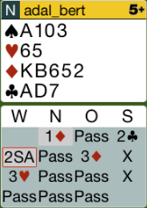
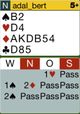
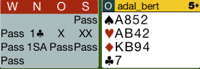
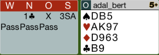
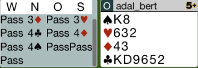

## Board 1

Das richtige Ausspiel ist hier das Treff-Ass und nicht Trumpf.
Der Partner muss mit 99% iger Wahrscheinlichkeit den Treff König haben.

Hier das komplette [Board-1](images/board1.png)

## Board 2

Es macht keinen Sinn, die Karo-Farbe zu reizen. Die Gegner versuchen
vielleicht einen SA-Kontrakt.

Hier das komplette [Board-2](images/board2.png)

## Board 7

Der Partner passt, da er keine 9 Punkte hat. Ausspiel sollte Karo-4 sein.

Hier das komplette [Board-7](images/board7.png)

## Board 13

Der Partner spielt die Pik-7 aus. Dies ist die 2 höchste von Pik.
Nord spielt das Ass. Die richtige Zugabe ist die Pik-Dame!
So kann man die Kommunikation mit dem Partner in Pik aufrechterhalten.

Hier das komplette [Board-13](images/board13.png)

## Board 14

Wenn der Gegner 4T - Cuebid reizt, muss man mit dieser Treff kontrieren,
damit der Partner ein sicheres Ausspiel hat.

Hier das komplette [Board-14](images/board14.png)
