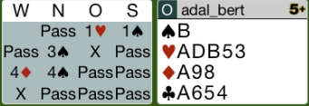
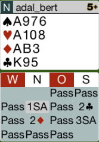
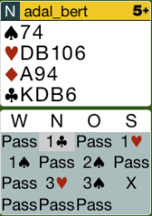
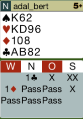
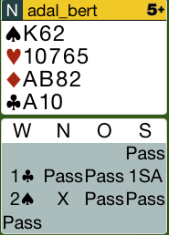

## Board 1

Das Kontra auf 3Pik ist falsch. Der Partner kann 0 Punkte haben.
Der Pik B zählt nicht, somit hat man nur 15 Punkte. Mit 17 Punkten kann man
kontrieren. Hier lässt man den Gegner spielen.

Hier das komplette [Board-1](images/board1.png)

## Board 6

Das Pik - Ausspiel muss man mit dem Ass sofort nehmen. Es kann sein, dass die 9 noch 
einen Stich macht. 

In Treff muss man klein zum König spielen. Man muss das Ass raustreiben.

Hier das komplette [Board-6](images/board6.png)

## Board 8

Hier haben wir nicht die Majorität der Punkte, somit muss man versuchen, den Gegner zu kürzen.
Das richtige Ausspiel ist C-D.

Hier das komplette [Board-8](images/board8.png)

## Board 9

Karo 10 ist das richtige Ausspiel, der Partner hat dann aber nicht Trumpf zurückgespielt,
sondern auf Coeur gewechselt. Somit muss man Coeur weiterspielen.

Hier das komplette [Board-9](images/board9.png)

## Board 11

Das richtige Ausspiel ist die Pik-2!

Hier das komplette [Board-11](images/board11.png)
