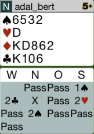
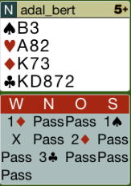
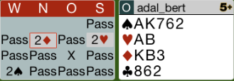
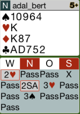

## Board 1

2P in dieser Situation ist non-forcing und zeigt nur eine Präferenz für
Pik. Da man allerdings 4er Pik und 10 Punkte hat, muss man hier einladen.
Dies funktioniert mit der einzigen forcierenden Reizung 3T. Dies ist der
Überruf der gegnerischen Farbe.

Hier das komplette [Board-1](images/board1.png)

## Board 4

Nach Kontra muss man rekontrieren, um seine Stärke zu zeigen (11+).

Hier das komplette [Board-4](images/board4.png)

## Board 7

Kontra ist falsch, da es nicht die Hand beschreibt. 2SA wäre besser.
Dann spielt die richtige Seite den Pik-Kontrakt.

Hier das komplette [Board-7](images/board7.png)

## Board 12

2SA ist hier falsch, man hat eine massive Hand und kann hier den
*Cue-Bid-Transfer* anwenden.

Hier das komplette [Board-12](images/board12.png)

