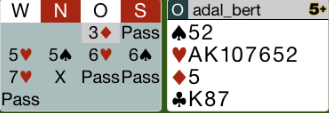
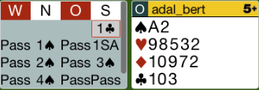
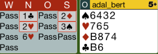
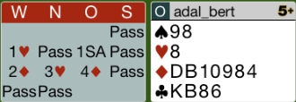
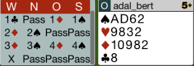

## Board 2

Man hat keine Verteidigung gegen 6P, deshalb sollte man nach 5P passen.
Der Gegner geht vielleicht nicht in den Schlemm.

Hier das komplette [Board-2](images/board2.png)

## Board 3

Das Kontra auf den 4Pik Kontrakt ist ein *Lightner*-Kontra.
Das richtige Ausspiel ist die Treff 10.

Hier das komplette [Board-3](images/board3.png)

## Board 4

Es ist schwierig auszuspielen, jedoch sollte man den Treff-B versuchen.

Hier das komplette [Board-4](images/board4.png)

## Board 7

Wenn der Partner eine 5er Coeur zeigt und der Gegner reizt 3C, dann sollte man 
seinem Partner vertrauen und zu ihm durchpassen.

Hier das komplette [Board-7](images/board7.png)

## Board 13

Die Reizung 2K zeigt eine echte Eröffnung.
Das Pass nach 2Pik vom Gegner ist richtig, aber nach 3Pik vom Gegner
muss man kontrieren.

Hier das komplette [Board-13](images/board13.png)
