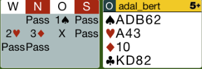

## Board 5

Wenn wir die Majorität der Punkte haben, dann ist Kontra immer gleich Strafkontra.
Richtig wäre Pass gewesen, dann hätten wir den Groß-Schlemm in Coeur gefunden.

Hier das komplette [Board-5](images/board5.png)

## Board 9

Nach 3SA sollte man im Team kein Risiko eingehen und den sicheren Kontrakt 4P wählen.

Hier das komplette [Board-9](images/board9.png)

## Board 11

Der Kontrakt fällt, wenn ich sofort die Treff D mit dem Treff K decke.
Der Alleinspieler kommt nicht mehr an den Tisch.

Hier das komplette [Board-11](images/board11.png)

## Board 12

Der Partner kann maximal 12 Punkte haben. Wenn man nach 3SA jetzt 4Pik reizt,
zeigt man 19 Punkte und will Schlemm spielen. Dies ist mit 16 Punkten etwas überzogen.

Hier das komplette [Board-12](images/board12.png)

## Board 15

Mit einer offensiven Hand sollte man 2SA reizen, mit einer defensiven Hand allerdings nicht.

Hier das komplette [Board-15](images/board15.png)
